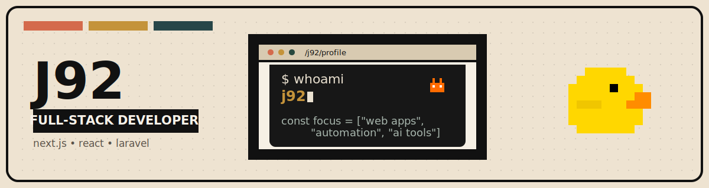

  

  Full Stack Developer building web apps, automation workflows, and practical AI tools.

  <a href="https://www.mlnoffice.com">Website</a> •
  <a href="https://www.linkedin.com/in/ionut-robert-balasoiu">LinkedIn</a> •
  <a href="https://github.com/ionutrobert?tab=repositories">Repos</a>

## What I work with

## Current focus

- automation workflows
- AI-assisted tooling
- product-style web apps
- clean frontend architecture

## Links

- Website: [mlnoffice.com](https://www.mlnoffice.com)
- LinkedIn: [ionut-robert-balasoiu](https://www.linkedin.com/in/ionut-robert-balasoiu)
